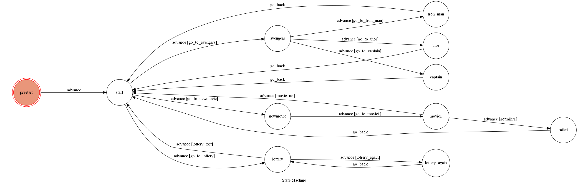

# Movie Chat Bot 

describe

## Setup

### Prerequisite
* Python 3

#### Install Dependency
```sh
pip install -r requirements.txt
```

* pygraphviz (For visualizing Finite State Machine)
    * [Setup pygraphviz on Ubuntu](http://www.jianshu.com/p/a3da7ecc5303)

### Secret Data

`API_TOKEN` and `WEBHOOK_URL` in app.py **MUST** be set to proper values.
Otherwise, you might not be able to run your code.

### Run Locally
You can either setup https server or using `ngrok` as a proxy.

**`ngrok` would be used in the following instruction**

```sh
ngrok http 5000
```

After that, `ngrok` would generate a https URL.

You should set `WEBHOOK_URL` (in app.py) to `your-https-URL/hook`.

#### Run the sever

```sh
python3 app.py
```

## Finite State Machine


## Bonus setup (需額外安裝)

#### 網路爬蟲
```sh
Python -m pip install BeautifulSoup4
```
```sh
Python -m pip install requests 
```
#### 用來動態獲取ngrok網址

需要curl指令，exe放在D/curl 資料夾中(自己新建一個curl資料夾)

curl下載網址:
https://curl.haxx.se/download.html


## Usage
* 一開始的 state為 `prestart`,chatbot會自動開始對話並到 `start`.共有3個對話分支.

	* Input: "avengers" 
		* Reply: "The Avengers is a Cool movie,which hero is your favorite?"
		進入第一個對話分支
		
	* Input: "lottery"  
		* Reply: 一部隨機推薦的電影
		進入第二個對話分支
		
	* Input: "newmovie" 
		* Reply:
		進入第三個對話分支

* 第一個對話分支:(state : avengers)
	* Input: "iron man"
		* Reply: "He is funny and cool."、並附上一段鋼鐵人的影片 
		執行完後回到start
		
	* Input: "thor"
		* Reply: "He is also my favorite hero."、並附上一段雷神索爾的影片 
		執行完後回到start
		
	* Input: "captain"
		* Reply: "He is strong and brave."、並附上一段美國隊長的影片 
		執行完後回到start

* 第二個對話分支:(state : lottery)
	* Input: "again"
		* Reply: 一部推薦的電影
		執行完後回到自己，所以可以無限的打again產生推薦的電影
		
	* Input: "exit"
	
* 第三個對話分支:
